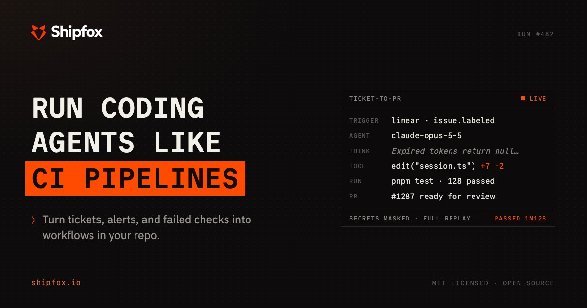
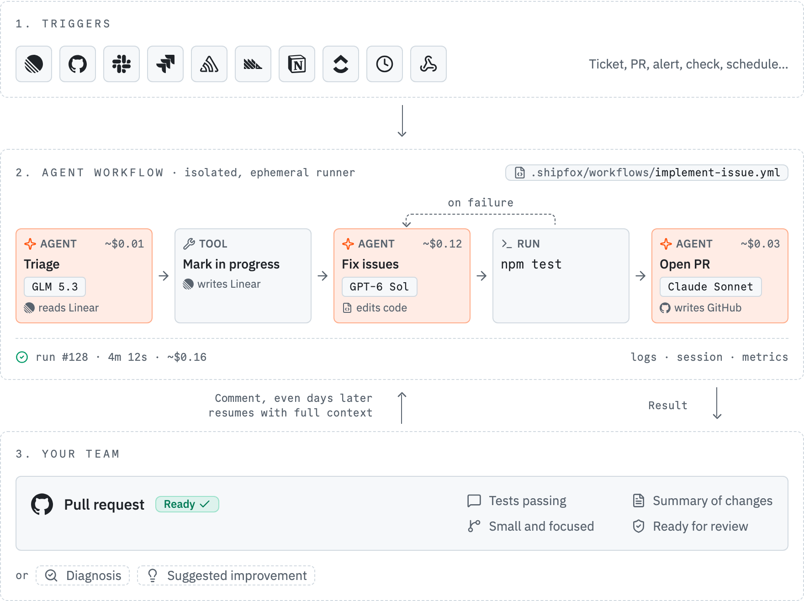

  

  <a href="https://www.shipfox.io/docs"><b>Docs</b></a> ·
  <a href="https://www.shipfox.io/docs/getting-started"><b>Getting started</b></a> ·
  <a href="https://www.shipfox.io/docs/understand"><b>Concepts</b></a> ·
  <a href="https://join.slack.com/t/shipfoxcommunity/shared_invite/zt-42wdu4lvl-KiYxEKCzzHUCafiC0EjbVA"><b>Slack community</b></a> ·
  <a href="CONTRIBUTING.md"><b>Contributing</b></a>

## Turn recurring engineering work into agent workflows

Shipfox runs your recurring engineering work with coding agents and returns it
ready for your team.

A big part of your team's week goes to recurring work: small tickets,
dependency updates, failing checks, alerts, release chores. Coding agents made
each engineer faster, but the work is still manual, one task at a time. And the
more your agents produce, the more piles up for a human to review.

Shipfox turns this work into workflows that start on their own and come back
ready for a human. One opens a pull request, small and with your checks already
passing. One triages dependency updates and merges the safe ones under your
rules. One investigates an alert and suggests a fix. You set the rules: which
model runs each step, what each agent can touch, and where a person signs off.
Only the work that needs judgment reaches your team.

And the factory improves itself. Run workflows that watch your other runs, find
what is slow or failing, and suggest changes.

## Run coding agents like CI pipelines

<picture>
  <source media="(prefers-color-scheme: dark)" srcset="apps/docs/public/readme/workflow-overview-dark.png" />
  <source media="(prefers-color-scheme: light)" srcset="apps/docs/public/readme/workflow-overview-light.png" />
  
</picture>

1. An event starts a workflow. A ticket, a new pull request, an alert, a failed
   check, or a schedule.
2. The workflow does the work. It mixes AI agents with the exact commands you
   choose, in an isolated environment with a full log and the cost of every run
   visible.
3. The result reaches your team. A pull request, a diagnosis, or a suggested
   improvement, ready to approve. Leave a comment and the workflow continues.

Workflows live as YAML in your repo, and you review them like any other code.
Any model per step, any stack. Open source.

Coding agents make each engineer faster. Shipfox gives your whole team a
software factory that builds, checks, and improves itself.

[Get your first workflow running now](https://www.shipfox.io/docs/getting-started).

## Highlights

- **Agents that stay under control.** Agent steps, where a model decides what to
  do, sit next to shell steps that run your exact commands. You set the
  structure. The model works inside it.
- **Loops that run until the result is correct.** A
  [gate](https://www.shipfox.io/docs/understand/feedback-loops) is a pass/fail
  check on a step. When it fails, the workflow loops back to an earlier step and
  tries again, up to a safe limit. That is how an agent keeps going until the
  tests pass, with no scripting.
- **Long-running, event-driven agents.** A [listening
  job](https://www.shipfox.io/docs/understand/listening-jobs) stays alive across
  a run and runs an agent on each new batch of events (PR review comments, new
  issues) until a resolution condition is met. Asynchronous agent loops, not
  one-shot runs.
- **Triggers from your whole stack.** Start runs from GitHub, Sentry, Slack,
  Linear, and more through integrations. Missing one? Point it at the [generic
  webhook](https://www.shipfox.io/docs/integrations/webhooks) and trigger on its
  events too. Connect several of the same provider and target each independently.
- **Secure by design.** Each job runs isolated in a runner next to your code that
  polls outbound for work, so nothing connects in. No data stays between two
  runs, and each agent reaches only the tools you allow.
- **One place to control everything.** Every run streams its jobs, steps, agent
  messages, thinking, tool calls, tokens, and cost while it happens.
- **Your harness, your keys.** Run an agent step on the `pi` harness (any of 30+
  model providers) or the `claude` harness (the Claude Agent SDK on your
  Anthropic key), chosen per step.
- **Open source and self-hostable.** The whole platform is MIT licensed. Run it
  on your own infrastructure so that your code and your credentials never leave
  it.

## What teams build with Shipfox

- **Triage monitoring errors.** A new error starts an agent that produces a fix
  and opens a pull request.
- **Turn tickets into code.** An assigned ticket starts an agent that opens a
  pull request and responds to review comments.
- **Fix failing CI.** A failing check starts an agent that produces a fix and
  makes the check pass again.
- **Review pull requests.** Each new pull request gets an agent review based on
  the team's guidelines, with follow-up on later changes.

## Getting started

Start with the [Getting Started guide](https://www.shipfox.io/docs/getting-started).
Self-hosting Shipfox? See the
[installation docs](https://www.shipfox.io/docs/installation).

Contributing to Shipfox? Read [CONTRIBUTING.md](CONTRIBUTING.md).

## Documentation

Full documentation is published at [shipfox.io/docs](https://www.shipfox.io/docs).

## Community

- **Slack:** join the [Shipfox community Slack](https://join.slack.com/t/shipfoxcommunity/shared_invite/zt-42wdu4lvl-KiYxEKCzzHUCafiC0EjbVA)
  for help, ideas, and release news.
- **Issues:** report bugs and request features on
  [GitHub Issues](https://github.com/ShipfoxHQ/shipfox/issues).

## Security

Report vulnerabilities privately by emailing **security@shipfox.io** rather
than opening a public issue. See [SECURITY.md](SECURITY.md) for details. Shipfox's
token and trust model is documented in the
[auth security model](libs/api/auth/README.md).

## Contributing

Read [CONTRIBUTING.md](CONTRIBUTING.md) before you open a pull request. Its task
map links to the engineering guide for each change.

## License

[MIT License](LICENSE)
