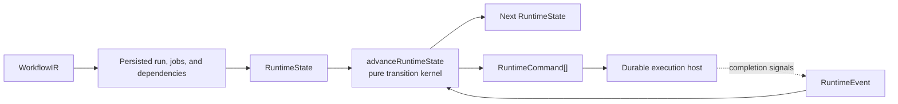

# 006 Runtime Transitions

Status: normative
Source of truth: libs/api/workflows/src/core/runtime/

## Purpose

Document the pure job-level runtime transition system.

## Normative Model

- PR1 runtime formalization is job-level.

- Runtime transition logic should be pure and replayable.

- Temporal remains the durable execution host around semantic decisions.

- Runtime input is expected to be normalized and statically validated before transition replay.

<!-- generated by libs/api/workflows/scripts/generate-formalization-docs.ts; do not edit generated sections directly -->
<!-- generated:start -->
- Runtime state owner: `libs/api/workflows/src/core/runtime/runtime-state.ts`.

- Runtime event owner: `libs/api/workflows/src/core/runtime/runtime-event.ts`.

- Runtime command owner: `libs/api/workflows/src/core/runtime/runtime-command.ts`.

- Runtime transition owner: `libs/api/workflows/src/core/runtime/transition.ts`.

- Golden traces live under `libs/api/workflows/src/core/runtime/traces/`.

- Runtime dependencies resolve against `RuntimeJobState.name`; `RuntimeJobState.id` identifies command targets.

### Runtime State Reference

#### RuntimeRunStatus

Alias: `'pending' | 'running' | 'succeeded' | 'failed'`.

#### RuntimeJobStatus

Alias: `'pending' | 'running' | 'succeeded' | 'failed' | 'cancelled'`.

#### RuntimeState

| Field | Type |
| --- | --- |
| `run` | `RuntimeRunState` |
| `jobs` | `RuntimeJobState[]` |

#### RuntimeRunState

| Field | Type |
| --- | --- |
| `status` | `RuntimeRunStatus` |

#### RuntimeJobState

| Field | Type |
| --- | --- |
| `id` | `string` |
| `name` | `string` |
| `dependencies` | `string[]` |
| `status` | `RuntimeJobStatus` |

### Runtime Event Reference

#### RuntimeEvent

Alias: `RunStartedEvent | JobCompletedEvent`.

#### RunStartedEvent

| Field | Type |
| --- | --- |
| `type` | `'run_started'` |

#### JobCompletedEvent

| Field | Type |
| --- | --- |
| `type` | `'job_completed'` |
| `jobId` | `string` |
| `status` | `'succeeded' \| 'failed'` |

### Runtime Command Reference

#### RuntimeCommand

Alias: `StartJobCommand | CancelJobCommand | CompleteRunCommand`.

#### StartJobCommand

| Field | Type |
| --- | --- |
| `type` | `'start_job'` |
| `jobId` | `string` |

#### CancelJobCommand

| Field | Type |
| --- | --- |
| `type` | `'cancel_job'` |
| `jobId` | `string` |

#### CompleteRunCommand

| Field | Type |
| --- | --- |
| `type` | `'complete_run'` |
| `status` | `'succeeded' \| 'failed'` |

### Runtime Transition Rule Summary

| Rule | Input | Output |
| --- | --- | --- |
| Terminal run guard | `RuntimeState.run.status` is `succeeded` or `failed`. | Return a cloned state and emit no commands. |
| `run_started` | Run is not terminal. | Set run status to `running`, then reconcile jobs. |
| `job_completed` | Matching job exists and is `running`. | Set the job status to the event status, then reconcile jobs; otherwise no-op. |
| Blocked pending jobs | Pending job depends on a failed or cancelled job. | Mark it `cancelled` and emit `cancel_job`. |
| Ready pending jobs | Pending job has all dependencies `succeeded`. | Mark it `running` and emit `start_job`. |
| No progress | Pending jobs remain, no job is running, and no job started. | Cancel remaining pending jobs. |
| Terminal jobs | Every job is `succeeded`, `failed`, or `cancelled`. | Complete the run as `succeeded` only when no job failed or was cancelled. |

### Runtime Golden Trace Reference

| File | Trace Name | Purpose | Jobs | Steps | Final Run Status | Command Types |
| --- | --- | --- | --- | --- | --- | --- |
| `minimal-success.json` | minimal success | Single root job succeeds and completes the run. | 1 | 2 | succeeded | `start_job`, `complete_run` |
| `job-failure-cancels-dependent.json` | job failure cancels dependent | Failed prerequisite cancels its pending dependent and fails the run. | 2 | 2 | failed | `start_job`, `cancel_job`, `complete_run` |

- Wall-clock timeout remains a Temporal durable execution host concern and is intentionally absent from the pure transition kernel.
<!-- generated:end -->

## Architecture Role

The pure runtime kernel is the semantic decision layer for workflow execution. It receives normalized runtime state and a runtime event, then returns the next state plus commands for the durable execution host to interpret.

The kernel must stay independent from Temporal, PostgreSQL, runners, agents, GitHub, shell commands, clocks, queues, and network APIs. That boundary makes runtime behavior deterministic, replayable, and testable through unit tests and golden traces.

PR1 keeps the kernel job-level: it decides when jobs start, when blocked jobs are cancelled, and when the run reaches a terminal status. Step-level execution, command execution, and external side effects remain outside this kernel.

## Kernel Data Flow

## Kernel Responsibilities

| Responsibility | Current PR1 Scope | Outside The Kernel |
| --- | --- | --- |
| Readiness | Start a pending job when all declared dependencies succeeded. | Selecting a physical runner or executing job steps. |
| Blocking | Cancel pending jobs whose dependencies failed or were cancelled. | Force-stopping active runner work. |
| Completion | Complete the run once every job is terminal. | Persisting the completion row or publishing events. |
| Replayability | Produce deterministic commands from state and event. | Timers, retries, backoff, wall-clock reads, database writes, and network calls. |

## Examples

A failed job cancels dependent jobs according to job-level dependency rules.

## Adding Or Changing This Concept

Add transition metadata, golden traces, durable execution host updates, and docs in the same commit sequence.

## Deferred Work

- Step-level runtime transitions.

- Runtime state snapshots.
