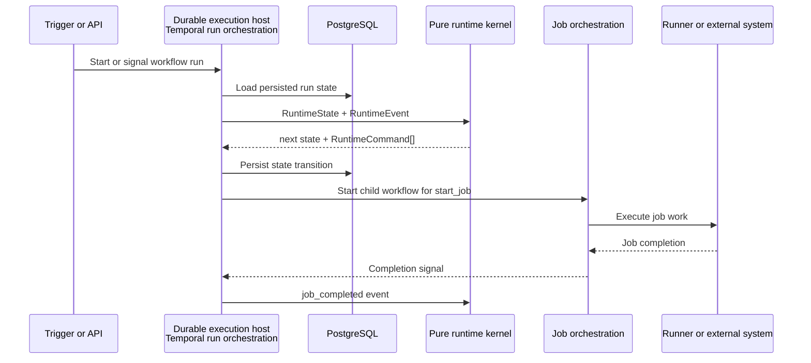

# 007 Durable Execution Host

Status: normative
Source of truth: libs/api/workflows/src/temporal/

## Purpose

Describe how Temporal and persistence adapt pure runtime commands to durable execution.

## Normative Model

- Temporal is responsible for durability, timers, activities, and signal interpretation.

- Runtime semantics belong in the pure kernel.

- Temporal interprets runtime commands through child workflows and activities.

- This layer is similar in spirit to a functional core / imperative shell, but Shipfox calls it the durable execution host to avoid confusion with shell-command steps.

<!-- generated by libs/api/workflows/scripts/generate-formalization-docs.ts; do not edit generated sections directly -->
<!-- generated:start -->
- Durable execution host owner: `libs/api/workflows/src/temporal/workflows/run-orchestration.ts`.

- Job execution host owner: `libs/api/workflows/src/temporal/workflows/job-orchestration.ts`.

- Activity adapter owner: `libs/api/workflows/src/temporal/activities/orchestration-activities.ts`.

### Runtime Command Adapter Reference

| Runtime Command | Temporal Operation | Owner | Persistence Side Effect | Current PR1 Limitation |
| --- | --- | --- | --- | --- |
| `start_job` | Collect into the current batch and execute one child `jobOrchestration` workflow per job. | libs/api/workflows/src/temporal/workflows/run-orchestration.ts#applyRuntimeCommands | `jobOrchestration` marks the job `running`, enqueues the runner job, then persists the terminal job status. | The parent awaits the emitted start-job batch before reconciling downstream runtime commands. |
| `cancel_job` | Call `setJobStatus` directly from `runOrchestration`. | libs/api/workflows/src/temporal/workflows/run-orchestration.ts#applyRuntimeCommands | Updates the durable job status to `cancelled` with optimistic versioning. | Cancellation is status-only for pending jobs; active runner cancellation remains outside the PR1 runtime kernel. |
| `complete_run` | Call `setRunStatus` directly from `runOrchestration`. | libs/api/workflows/src/temporal/workflows/run-orchestration.ts#applyRuntimeCommands | Updates the durable workflow-run status to the runtime command status with optimistic versioning. | The runtime command only carries final status; run summaries and snapshots remain outside PR1. |

### Temporal Workflow Reference

| Workflow | Owner | Role |
| --- | --- | --- |
| `runOrchestration` | libs/api/workflows/src/temporal/workflows/run-orchestration.ts | Loads the durable DAG, initializes runtime state, feeds runtime events to the pure kernel, and adapts emitted commands. |
| `jobOrchestration` | libs/api/workflows/src/temporal/workflows/job-orchestration.ts | Executes one durable job by marking it running, enqueueing runner work, waiting for completion or timeout, and returning terminal status. |

### Temporal Activity Reference

| Activity | Owner | Side Effect |
| --- | --- | --- |
| `loadRunDag` | libs/api/workflows/src/temporal/activities/orchestration-activities.ts | Reads workflow-run, job, and step rows used to initialize runtime state. |
| `setRunStatus` | libs/api/workflows/src/temporal/activities/orchestration-activities.ts | Updates workflow-run status with optimistic versioning. |
| `setJobStatus` | libs/api/workflows/src/temporal/activities/orchestration-activities.ts | Updates job status with optimistic versioning. |
| `enqueueJobForRunner` | libs/api/workflows/src/temporal/activities/orchestration-activities.ts | Publishes runner work through the runners package. |
| `applyStepResultsActivity` | libs/api/workflows/src/temporal/activities/orchestration-activities.ts | Maps runner completion DTOs to domain step results and persists them. |
| `failJobAsTimedOutActivity` | libs/api/workflows/src/temporal/activities/orchestration-activities.ts | Atomically marks a timed-out job failed and writes the timeout outbox event. |
| `bulkSetStepStatuses` | libs/api/workflows/src/temporal/activities/orchestration-activities.ts | Bulk-updates step statuses after timeout failure. |

- Job timeout remains in `jobOrchestration` and timeout activities.

- Current run orchestration awaits each emitted `start_job` batch as a batch before processing downstream commands.
<!-- generated:end -->

## Architecture Role

The durable execution host runs the pure runtime semantics in a reliable operational environment. It owns Temporal workflows, activities, persistence adapters, child workflow scheduling, timers, and future side-effect adapters.

The host does not decide workflow semantics directly. It loads durable state, converts external signals into runtime events, invokes the pure kernel, persists the resulting state changes, and adapts emitted commands into Temporal or activity work.

Runners sit behind this host boundary. A runner executes job work and reports completion; the durable host translates that completion into the next runtime event so the kernel can make the next semantic decision.

## Execution Host Flow

## Main Components

| Component | Role | Owned In |
| --- | --- | --- |
| Run orchestration workflow | Hosts the run loop, interprets runtime commands, starts child job workflows, and applies durable status updates. | `libs/api/workflows/src/temporal/workflows/run-orchestration.ts` |
| Job orchestration workflow | Owns durable job execution, timeout handling, and job completion signaling. | `libs/api/workflows/src/temporal/workflows/job-orchestration.ts` |
| Orchestration activities | Perform database reads and writes that the pure kernel cannot perform. | `libs/api/workflows/src/temporal/activities/orchestration-activities.ts` |
| PostgreSQL workflow-run tables | Store normalized runs, jobs, dependencies, statuses, and versions derived from WorkflowIR. | `libs/api/workflows/src/db/` |
| Runner boundary | Executes concrete job work and eventually reports completion or failure back through orchestration. | `apps/runner`, `libs/api/runners` |

## Examples

Temporal can keep timeout handling while delegating readiness decisions to the kernel.

## Adding Or Changing This Concept

Update execution-host adapters and tests only when persistence, Temporal, outbox, runner, or trigger behavior changes.

## Deferred Work

- Runtime state snapshots.

- Pipelined child workflow scheduling across sibling branches.
